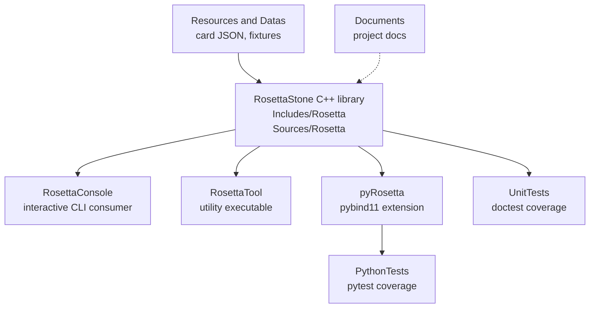
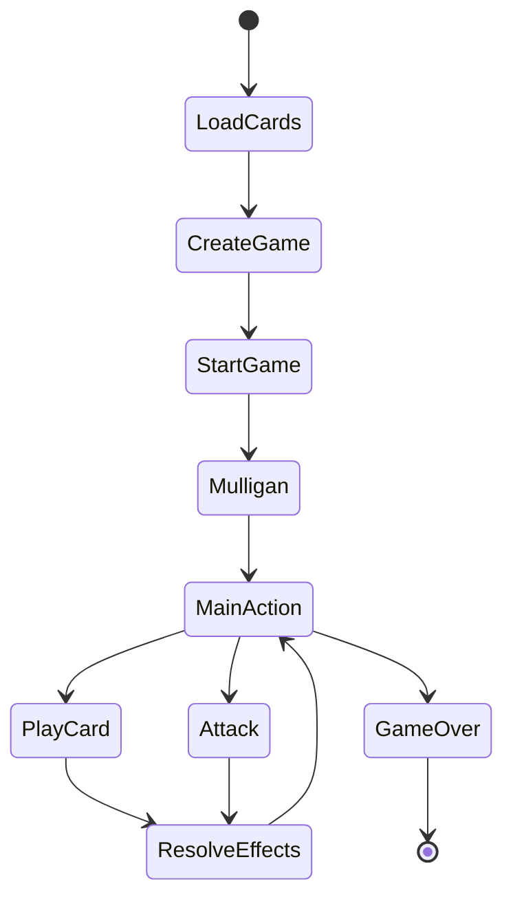
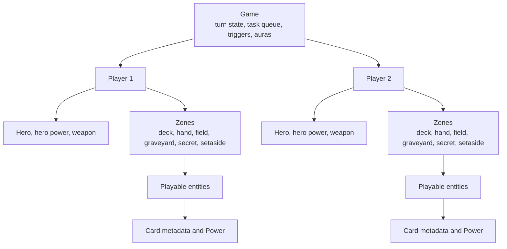
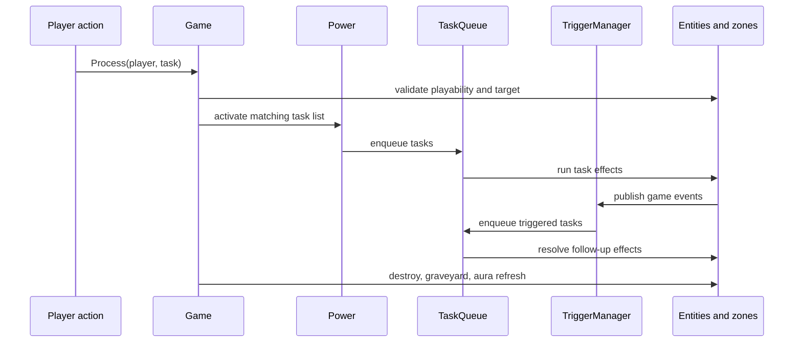
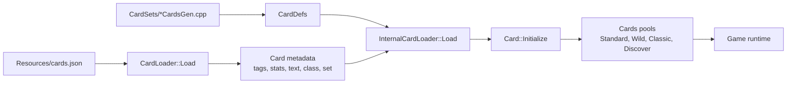
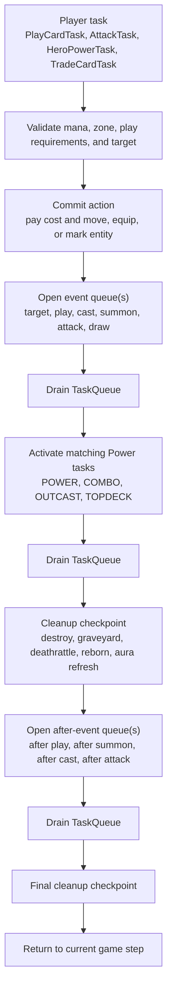
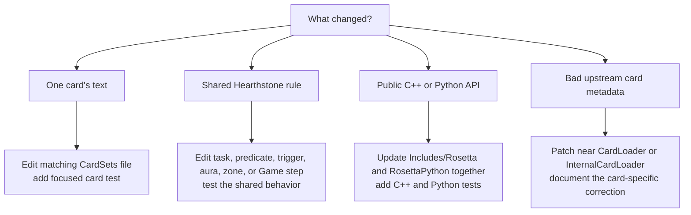

# Architecture

RosettaStone is distributed and consumed in the following ways:

- A C++23 Hearthstone simulator library for use from C++.
- A `pyRosetta` Python extension exposed through pybind11.
- Console and utility executables built on top of the same simulator library.

## Overview

RosettaStone models Hearthstone normal play mode and Battlegrounds with separate
simulator trees. The shared C++ library lives in `Includes/Rosetta/` and
`Sources/Rosetta/`. Public headers define the API and data model; source files
own game flow, card loading, task execution, triggers, auras, and generated card
logic.

The Python extension in `Extensions/RosettaPython/` mirrors the C++ API where it
is intended to be scriptable. The console and tool programs under
`Extensions/RosettaConsole/` and `Extensions/RosettaTool/` are consumers of the
same `RosettaStone` target, not separate implementations.

## At A Glance

Most changes start in the C++ library. The console, tool, Python extension, and
tests should follow the library model rather than reimplementing simulator
behavior. Card data flows in from `Resources/`; documentation and tests explain
and verify the behavior rather than owning it.

## Game Flow

The play-mode simulator generally processes a game in these phases:

1. Load card metadata from `Resources/cards.json` and
   `Resources/cards.collectible.json`.
2. Create a `Game` from `GameConfig`, decks, heroes, and format settings.
3. Advance through the game steps until players can act.
4. Execute player choices such as playing cards, attacking, or using hero powers.
5. Resolve task chains, enchantments, auras, triggers, zone changes, and damage.
6. Continue until a hero reaches a losing state.

## Core PlayMode Model

PlayMode is centered on a small set of runtime objects:

- `Game`, in `Includes/Rosetta/PlayMode/Games/Game.hpp`, owns both players,
  turn state, entity IDs, the task queue, the task stack, active triggers,
  active auras, and one-turn effects. Game-step methods such as `BeginDraw`,
  `MainAction`, `MainEnd`, and `FinalGameOver` define the turn pipeline.
- `Player`, in `Includes/Rosetta/PlayMode/Models/Player.hpp`, owns the hero,
  hero power, weapon, mana, counters, choice state, play history, and per-player
  zones.
- `Entity`, in `Includes/Rosetta/PlayMode/Models/Entity.hpp`, is the base for
  runtime objects that carry `GameTag` state. It points back to the owning
  `Game`, `Player`, `Card`, and `IZone`.
- `Playable`, in `Includes/Rosetta/PlayMode/Models/Playable.hpp`, is an
  `Entity` that can move from hand into play. It owns playability checks,
  target validation, cost state, and `ActivateTask`.
- `IZone` and its concrete zones under `Includes/Rosetta/PlayMode/Zones/` own
  where playables reside: deck, hand, battlefield, graveyard, secret, and
  setaside.

The stable rule of thumb is: cards describe what an object is, entities describe
the current in-game instance, zones describe where the instance lives, and
`Game` coordinates the transition between states.

## Effect Model

Card behavior is mostly data plus task composition:

- `CardDef`, in `Includes/Rosetta/PlayMode/Cards/CardDef.hpp`, stores a
  `Power` and `CardProperty`.
- `Power`, in `Includes/Rosetta/PlayMode/Enchants/Power.hpp`, stores play,
  deathrattle, combo, topdeck, choose-one, outcast, spellburst, frenzy, and
  honorable-kill task lists, plus optional aura, enchantment, and trigger data.
- `ITask`, in `Includes/Rosetta/PlayMode/Tasks/ITask.hpp`, is the executable
  unit. Concrete tasks should do one small operation and use `TaskStack` when
  they need to pass selected entities or numbers to the next task.
- `TaskQueue` stores tasks that must resolve in order, including nested event
  queues. `Game::ProcessTasks()` drains that queue.
- `TriggerManager`, in `Includes/Rosetta/PlayMode/Managers/TriggerManager.hpp`,
  exposes event channels such as draw, play, cast, attack, summon, damage,
  death, and turn start/end.
- Trigger routing is separate from trigger effects. `TriggerType` chooses the
  event channel, `TriggerSource` chooses whose event can satisfy it,
  `TriggerActivation` chooses where the trigger works from (`PLAY`, `HAND`,
  `DECK`, or `HAND_OR_PLAY`), and `SequenceType` filters play/target sequences
  such as play-card, play-minion, play-spell, and target.
- Auras and enchantments live under `Includes/Rosetta/PlayMode/Auras/` and
  `Includes/Rosetta/PlayMode/Enchants/`. Use them for persistent effects
  instead of repeating temporary tag writes in card tasks.

Prefer composing existing tasks before adding a new task class. Add a new task
only when the same behavior would otherwise be duplicated across card
implementations or belongs in the engine rather than one card block.

## Module Map

The core C++ modules are grouped by domain:

- `Includes/Rosetta/PlayMode/` and `Sources/Rosetta/PlayMode/` contain normal
  Hearthstone gameplay: actions, cards, card sets, games, tasks, triggers,
  auras, zones, managers, and loaders.
- `Includes/Rosetta/Battlegrounds/` and `Sources/Rosetta/Battlegrounds/`
  contain Battlegrounds-specific cards, combat, tavern behavior, tasks, and
  game state.
- `Includes/Rosetta/Common/` and `Sources/Rosetta/Common/` contain shared types
  and helpers used across simulator modes.
- `Extensions/RosettaPython/` contains the pybind11 declarations and
  implementations for the Python-facing API.
- `Tests/UnitTests/` contains doctest coverage for C++ behavior.
- `Tests/PythonTests/` contains pytest coverage for Python-visible behavior.
- `Resources/` and `Datas/` contain checked-in card data and test fixtures.
- `Documents/` contains project documentation and generated Doxygen input.

## Card Data And Behavior

Card metadata comes from the checked-in Hearthstone JSON resources. The loader
turns that data into card definitions, then card-set source files add behavior
that cannot be represented by metadata alone.

The PlayMode card load path is:

1. `CardLoader::Load()` reads `Resources/cards.json` and fills static metadata
   such as ID, dbf ID, name, text, tags, class, set, type, race, cost, attack,
   health, durability, spell school, and mechanics.
2. `InternalCardLoader::Load()` looks up each card's `CardDef` and copies power,
   play requirements, choose options, entourages, appendages, quest progress,
   linked hero powers, corrupt forms, and infused forms onto the `Card`.
3. `Card::Initialize()` finalizes targeting and derived card state.
4. `Cards` builds searchable pools for Standard, Wild, Classic, Discover,
   Lackeys, basic Totems, and other helpers.

Most play-mode card behavior lives in
`Sources/Rosetta/PlayMode/CardSets/*CardsGen.cpp`, with matching tests under
`Tests/UnitTests/PlayMode/CardSets/`. Battlegrounds card behavior stays in the
Battlegrounds tree and should not be mixed into PlayMode unless the behavior is
already shared.

Despite the `*CardsGen.cpp` names, these files are checked-in source files and
are edited directly when adding or fixing implemented card behavior.

Card implementations usually compose existing building blocks:

- `Power` task lists for play effects, battlecries, deathrattles, and other
  timed effects.
- `Task` classes for damage, draw, summon, filter, condition, flag, and zone
  operations.
- `Aura`, `Enchant`, and trigger helpers for persistent effects and event-based
  behavior.
- `CardDef` properties for target requirements, generated cards, quest progress,
  corrupt/infuse forms, hero powers, appendages, and random pools.

Targeting and playability are not card-effect code. Static play requirements
belong in `CardProperty::playReqs`; reusable dynamic checks belong in
`TargetingPredicates`; `Playable::IsPlayableByCardReq()` and
`Playable::IsValidPlayTarget()` enforce them before task resolution.

For a new card, read the card text as a Hearthstone mechanic first, then choose
the existing RosettaStone shape: metadata tags for keywords, `playReqs` or
`TargetingPredicates` for legal targets, `Power` task lists for one-shot
effects, triggers for event-based effects, and auras or enchantments for
persistent effects.

## Hearthstone Mechanic Mapping

`Documents/AbilityList.md` tracks which mechanics are implemented, and
`Documents/TaskList.md` lists available task building blocks. This architecture
document should not duplicate those lists. It should explain where a mechanic
belongs when a contributor has to implement or fix one.

An enum value, task hook, or helper method is not proof that the full Hearthstone
mechanic is supported. Treat `AbilityList.md`, existing card implementations,
and tests as the support-status source of truth.

| Hearthstone text shape                                                                                                              | RosettaStone implementation point                                                                                 |
| ----------------------------------------------------------------------------------------------------------------------------------- | ----------------------------------------------------------------------------------------------------------------- |
| Plain keyword stat, such as Taunt, Rush, Charge, Divine Shield, Stealth, Poisonous, Lifesteal, Windfury, Spell Damage, and Overload | Usually JSON metadata loaded into `GameTag`; avoid per-card tasks unless the card text does extra work.           |
| Tradeable                                                                                                                           | A keyword tag plus the `TradeCardTask` player action; avoid per-card tasks unless trading has extra text.         |
| Battlecry or normal play effect                                                                                                     | `Power::AddPowerTask(...)`, resolved from `PlayCard`/`CastSpell`.                                                 |
| Combo                                                                                                                               | `Power::AddComboTask(...)`, selected when `Player::IsComboActive()` is true.                                      |
| Deathrattle                                                                                                                         | `Power::AddDeathrattleTask(...)`, activated during graveyard processing.                                          |
| Outcast                                                                                                                             | `Power::AddOutcastTask(...)`, checked from the hand position before play.                                         |
| Spellburst                                                                                                                          | `Power::AddSpellburstTask(...)`, activated after the player casts a spell.                                        |
| Frenzy                                                                                                                              | `Power::AddFrenzyTask(...)`, activated from damage handling.                                                      |
| Honorable Kill                                                                                                                      | `Power::AddHonorableKillTask(...)`, activated when damage kills exactly.                                          |
| Casts When Drawn or topdeck effect                                                                                                  | `Power::AddTopdeckTask(...)`, resolved from draw handling.                                                        |
| Secret                                                                                                                              | A `Trigger` plus `ComplexTask::ActivateSecret(...)`; the card lives in `SecretZone`.                              |
| Quest, Sidequest, Questline                                                                                                         | Quest progress fields on `CardProperty` plus `QuestProgressTask` and secret-zone quest state.                     |
| Choose One                                                                                                                          | `CardProperty::chooseCardIDs`; option cards hold the actual effects.                                              |
| Discover or random generation                                                                                                       | Existing random/discover tasks and card pools from `Cards`.                                                       |
| Aura text, such as "Your minions have..."                                                                                           | `Power::AddAura(...)` and aura/effect classes.                                                                    |
| Buff, debuff, copied text, or temporary stat change                                                                                 | `AddEnchantmentTask(...)` plus a matching enchantment card when the effect must persist.                          |
| Target restriction                                                                                                                  | `CardProperty::playReqs` and `TargetingPredicates`, not the effect task.                                          |
| Location card                                                                                                                       | `CardType::LOCATION` currently follows the field/minion play path; also check location `PlayReq` values.          |
| Linked token, weapon, appendage, corrupt, or infused card                                                                           | `CardProperty` fields such as `entourages`, `appendages`, `corruptCardID`, `infusedCardID`, and `heroPowerDbfID`. |

If a mechanic is only a keyword tag, let the loader and existing `GameTag`
behavior carry it. If the mechanic changes timing, targets, zones, or persistent
state, put the behavior at the engine boundary that already owns that concern.

For newer card types or mechanics, check the whole path before assuming support:
`CardType.def`, `GameTag.def`, `PlayReq.def`, `CardLoader`, `InternalCardLoader`,
player actions, zones, card-set patterns, C++ tests, and Python bindings when the
surface is exposed. A parsed enum without action-flow support is only metadata.

## Effect Timing Contract

The exact code path differs for minions, spells, weapons, hero cards, attacks,
and draws, but the common timing contract is:

Important timing notes:

- Play requirements and target legality are checked before effect tasks run.
- Action paths can enter event queues and cleanup checkpoints more than once;
  the diagram shows the common order of checkpoints, not one global pass.
- A trigger usually starts an event queue, publishes matching trigger events,
  drains `TaskQueue`, then ends the event queue.
- `ProcessDestroyAndUpdateAura()` refreshes auras, processes summon/death
  events, moves dead minions to the graveyard, activates deathrattles, handles
  reborn, and refreshes auras again.
- Topdeck effects run during draw handling. Cards with "Casts When Drawn" move
  out of hand and can cause another draw.
- Infuse updates during graveyard processing when friendly minions die.
- Extra Battlecry, extra Deathrattle, and extra Secret trigger effects are
  player aura effects, not separate card implementations.

## Behavior Boundaries

Use the existing boundary that matches the mechanic:

- Game flow, turn progression, task draining, destroy processing, graveyard
  processing, and aura refresh belong to `Game`.
- Per-player resources, counters, hero state, hand/deck/field ownership, and
  choices belong to `Player`.
- Zone movement belongs to zone types and action/task helpers, not ad hoc vector
  edits in card code.
- Target validation belongs to play requirements and targeting predicates.
- One-shot effects belong to task lists on `Power`.
- Persistent stat changes belong to enchantments or auras.
- Event-based effects belong to triggers registered through `Power`.
- Card-specific metadata fixes belong near the loader when upstream JSON is
  wrong; card-specific behavior belongs in the matching card-set file.

Keep behavior changes at the lowest shared layer that owns the rule. A fix in a
single card block is right for one card; a fix in a task, predicate, loader, or
game step is right when several cards already route through that path.

## Battlegrounds Boundary

Battlegrounds is a separate simulator mode, not a PlayMode extension. Its
runtime lives under `Includes/Rosetta/Battlegrounds/` and
`Sources/Rosetta/Battlegrounds/`.

The Battlegrounds `Game` owns a `GameState`, player pairing, recruit/combat
phases, ghost fights, and rank calculation. Battlegrounds cards, tavern logic,
combat tasks, triggers, and tests should stay in the Battlegrounds tree unless a
type is already shared under `Common`.

## Python Extension

`Extensions/RosettaPython/` builds the `pyRosetta` module and links it against
the core `RosettaStone` library.

- `Extensions/RosettaPython/Includes/Python/PlayMode/` declares registration
  functions by exposed domain.
- `Extensions/RosettaPython/Sources/Python/PlayMode/` implements the pybind11
  bindings.
- `Extensions/RosettaPython/main.cpp` composes the module.

When public C++ behavior changes, check whether the Python binding and
`Tests/PythonTests/` need the same surface. Python-visible behavior should not
fork into a separate simulator model.

Python binding changes are usually needed when a change adds or renames public
types, enum values, card search behavior, deck helpers, constants, or loader
surface. Internal card task changes usually do not need Python changes unless
they alter observable gameplay that already has Python tests.

## Build Targets

The project is built through CMake.

- `Sources/Rosetta/CMakeLists.txt` builds the `RosettaStone` library and runs
  `Scripts/header_gen.py`.
- `Extensions/RosettaPython/CMakeLists.txt` builds the `pyRosetta` extension.
- `Extensions/RosettaConsole/CMakeLists.txt` builds the `RosettaConsole`
  executable.
- `Extensions/RosettaTool/CMakeLists.txt` builds the `RosettaTool` executable.
- `Tests/UnitTests/CMakeLists.txt` builds the `UnitTests` executable.
- `Builds/setup.py.in` is configured into `setup.py` for Python packaging.

`Includes/Rosetta/RosettaStone.hpp` is generated by `Scripts/header_gen.py`.
Treat headers under `Includes/Rosetta/` and the generator as the source of
truth, not the aggregate header.

## Visibility Rules

- Public C++ API belongs in `Includes/Rosetta/`.
- C++ implementation details belong in `Sources/Rosetta/`.
- Python binding declarations belong in `Extensions/RosettaPython/Includes/`.
- Python binding implementations belong in `Extensions/RosettaPython/Sources/`.
- PlayMode and Battlegrounds logic should stay in their own trees unless a type
  or helper is intentionally shared.
- Card metadata and fixtures belong in `Resources/` or `Datas/`.
- Do not add dependencies when the standard library or existing project helpers
  are enough.

## Developing

All native development should go through CMake targets. Before adding, moving,
or exposing files, check the relevant `CMakeLists.txt`.

For simulator behavior changes:

1. Update the public C++ header and implementation together.
2. Check callers and related tasks, triggers, auras, zones, and managers.
3. Mirror Python-visible changes in `Extensions/RosettaPython/`.
4. Add focused doctest coverage in `Tests/UnitTests/`.
5. Add pytest coverage in `Tests/PythonTests/` when the Python API changes.
6. Keep card and task implementations close to existing card-set patterns.

### Change Impact Checklist

Use this checklist before calling a non-documentation change complete:

| Change kind           | Check these places                                                                      |
| --------------------- | --------------------------------------------------------------------------------------- |
| Public enum or tag    | `Includes/Rosetta/Common/Enums/`, Python enum bindings, tests.                          |
| New PlayMode card     | JSON data, matching card-set file, linked tokens/enchantments, C++ test.                |
| New card mechanic     | Existing tasks first, then `Tasks/`, `Power`, triggers, auras, Python if exposed.       |
| New card type         | `CardType.def`, `PlayReq.def`, loader, player actions, zones, tests, Python if exposed. |
| Targeting change      | `CardProperty::playReqs`, `TargetingPredicates`, `Playable`, card tests.                |
| Zone or game-flow fix | `Game`, zone classes, action/player tasks, affected card tests.                         |
| Python-visible API    | Binding declaration, binding implementation, `main.cpp`, pytest.                        |
| Battlegrounds change  | Battlegrounds includes/sources/tests only, unless `Common` is truly shared.             |

### Testing Matrix

Use the narrowest validation that covers the changed behavior:

| Change type                | Suggested validation                                      |
| -------------------------- | --------------------------------------------------------- |
| Documentation-only         | Markdown review; no build required.                       |
| Core C++ behavior          | Build with CMake, then run `UnitTests`.                   |
| Python-visible behavior    | Build/install `pyRosetta`, then run `Tests/PythonTests/`. |
| Card implementation change | Run the matching card-set unit tests when possible.       |
| CMake or packaging change  | Reconfigure and build the affected targets.               |
