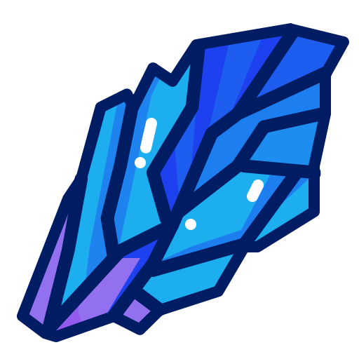

# RosettaStone



[](https://github.com/utilForever/RosettaStone/blob/master/LICENSE) [](https://travis-ci.org/utilForever/RosettaStone/branches) [](https://ci.appveyor.com/project/utilForever/RosettaStone/branch/master) [](https://utilforever.visualstudio.com/RosettaStone/_build/latest?definitionId=7&branchName=master) [](https://discord.gg/6R3UueR)

[](https://codecov.io/gh/utilForever/RosettaStone)
[](https://www.codacy.com/app/utilForever/RosettaStone?utm_source=github.com&amp;utm_medium=referral&amp;utm_content=utilForever/RosettaStone&amp;utm_campaign=Badge_Grade)
[](https://lgtm.com/projects/g/utilForever/RosettaStone/alerts/)
[](https://lgtm.com/projects/g/utilForever/RosettaStone/context:cpp)
[](https://www.codefactor.io/repository/github/utilforever/RosettaStone)

[](https://sonarcloud.io/dashboard?id=RosettaStone) [](https://sonarcloud.io/dashboard?id=RosettaStone) [](https://sonarcloud.io/dashboard?id=RosettaStone) [](https://sonarcloud.io/dashboard?id=RosettaStone) [](https://sonarcloud.io/dashboard?id=RosettaStone)

RosettaStone is Hearthstone simulator using C++ with some reinforcement learning. The code is built on C++17 and can be compiled with commonly available compilers such as g++, clang++, or Microsoft Visual Studio. RosettaStone currently supports macOS (10.14 or later), Ubuntu (18.04 or later), Windows (Visual Studio 2017 or later), and Windows Subsystem for Linux (WSL). Other untested platforms that support C++17 also should be able to build RosettaStone.

## Related Repositories

  * [RosettaStone GUI](https://www.github.com/utilforever/RosettaStone-GUI)

## Key Features

  * C++17 based Hearthstone library
  * Console and GUI simulator program
  * C++ and Python API

## To-do Features

  * Upgrade "The Innkeeper" to smart
  * Recommend top-tier decks
  * Deck tracker
  * Web simulator

## Roadmap

### 2020

  * Implement all standard cards
    * Rise of Shadows
    * Saviors of Uldum
    * Descent of Dragons
    * Ashes of Outland
    * Scholomance Academy
  * Implement programs for playing game
    * Console-based
    * GUI-based
    * Web-based
  * Prepare "Hearthstone pro gamer" vs AI match-up
  * Implement "Hearthstone Battlegrounds"
  * Support various deep-learning framework for RL environment
    * Tensorflow
    * PyTorch
  * Fully support Python API
  * Write a paper on Hearthstone's RL environment
  * Make architecture documents for contributors
  * Make tutorials for programs

### 2019

  * Implement all original cards
  * Implement console and GUI program
  * Provide RL environment using PyTorch C++ API
  * Support API for another language such as Python

### 2018

  * Implement basic system (game and task)
  * Implement basic console program
  * Implement some original cards
  * Support cross-platform build (Windows/Linux/MacOS)
  * Provide API documentation using doxygen

## Cards Implementation

### Basic & Classic

  * **100% Basic (143 of 143 Cards)**
  * **100% Classic (240 of 240 Cards)**
  * **100% Demon Hunter Initiate (20 of 20 Cards)**
  * 68% Hall of Fame (24 of 35 Cards)

### Adventures

  * 0% Galakrond's Awakening (0 of 35 cards)
  * 0% One Night in Karazhan (0 of 45 Cards)
  * 0% The League of Explorers (0 of 45 Cards)
  * 0% Blackrock Mountain (0 of 31 Cards)
  * 0% Curse of Naxxramas (0 of 30 Cards)

### Expansions

  * 0% Scholomance Academy (1 of 135 cards)
  * 0% Ashes of Outland (1 of 135 cards)
  * **100% Descent of Dragons (140 of 140 cards)**
  * 45% Saviors of Uldum (62 of 135 cards)
  * **100% Rise of Shadows (136 of 136 cards)**
  * 0% Rastakhan's Rumble (0 of 135 Cards)
  * 0% The Boomsday Project (0 of 135 Cards)
  * 0% The Witchwood (0 of 135 Cards)
  * 0% Kobolds & Catacombs (0 of 135 Cards)
  * 0% Knights of the Frozen Throne (0 of 135 Cards)
  * 0% Journey to Un'Goro (0 of 135 Cards)
  * 0% Mean Streets of Gadgetzan (0 of 132 Cards)
  * 0% Whispers of the Old Gods (0 of 134 Cards)
  * 0% The Grand Tournament (0 of 132 Cards)
  * 0% Goblins vs Gnomes (0 of 123 Cards)

## Implementation List

  * [Ability list](./Documents/AbilityList.md)
  * [Card list](./Documents/CardList.md)
  * [Task list](./Documents/TaskList.md)

## Quick Start

You will need CMake to build the code. If you're using Windows, you need Visual Studio 2017 in addition to CMake.

First, clone the code:

```
git clone https://github.com/utilForever/RosettaStone.git --recursive
cd RosettaStone
```

### Python API

Build and install the packagae by running

```
pip install -U .
```

**NOTE**: We are making Python API and related examples.

### C++ API

For macOS or Linux or Windows Subsystem for Linux (WSL):

```
mkdir build
cd build
cmake ..
make
```

For Windows:

```
mkdir build
cd build
cmake .. -G"Visual Studio 15 2017 Win64"
MSBuild RosettaStone.sln /p:Configuration=Release
```

Now run console simulator:

```
bin/RosettaConsole
```

**NOTE**: To run GUI simulator, please check out [RosettaStone GUI](https://www.github.com/utilforever/RosettaStone-GUI).

### Docker

```
docker pull utilforever/rosettastone:latest
```

Now run console simulator:

```
docker run -it utilforever/rosettastone
[inside docker container]
/app/build/bin/RosettaConsole
```

### More Instructions of Building the Code

To learn how to build, test, and install the SDK, please check out [Install.md](./Documents/Install.md).

## Documentation

All the documentations for the framework can be found from [the project website](https://utilforever.github.io/RosettaStone/) incluing the API reference.

## Presentations

  * [TFCON 2018 Poster Session](./Medias/Presentations/TFCON%202018%20-%20Hearthstone%2B%2B%2C%20Hearthstone%20Simulator%20with%20Reinforcement%20Learning.pdf)
  * [NDC 2019](./Medias/Presentations/NDC%202019%20-%20Development%20Process%20of%20Hearthstone%20Reinforcement%20Learning%20Environment%20(Korean).pdf)

## Videos
  
  * [NDC 2019](https://www.youtube.com/watch?v=yO9QRinXosE)

## Sprints

  * [PyCon Korea 2018 Sprint Session](https://archive.pycon.kr/2018/program/sprint/3)
  * [Sprint Seoul - April 2019](https://sprintseoul.org/)

## Articles

  * NDC 2019
    * [[NDC2019] 하스스톤을 위한 '알파고'를 만들 수는 없을까? - 인벤](http://www.inven.co.kr/webzine/news/?news=219330&site=hs)
    * [[NDC 19] '알파고' 같은 하스스톤 인공지능을 만들기 위한 험난한 여정 - 디스이즈게임](http://www.thisisgame.com/webzine/gameevent/nboard/227/?n=93644)
    * [[NDC2019 #11] 넥슨 프로그래머의 ‘하스스톤’ A·I 제작기 - 경향게임스](http://www.khgames.co.kr/news/articleView.html?idxno=118028)
    * [[NDC 2019] 넥슨 프로그래머의 ‘하스스톤’ AI 도전기 - OSEN](http://www.osen.co.kr/article/G1111130399)

## How To Contribute

Contributions are always welcome, either reporting issues/bugs or forking the repository and then issuing pull requests when you have completed some additional coding that you feel will be beneficial to the main project. If you are interested in contributing in a more dedicated capacity, then please check out [Contributing.md](./Documents/Contributing.md).

  * [Code of Conduct](./Documents/CodeOfConduct.md)
  * [Issues](./Documents/Issues.md)
    * [How to Contribute in Issues](./Documents/Issues.md#how-to-contribute-in-issues)
    * [Asking for General Help](./Documents/Issues.md#asking-for-general-help)
    * [Submitting a Bug Report](./Documents/Issues.md#submitting-a-bug-report)
    * [Triaging a Bug Report](./Documents/Issues.md#triaging-a-bug-report)
    * [Resolving a Bug Report](./Documents/Issues.md#resolving-a-bug-report)
  * [Pull request](./Documents/PullRequests.md)
    * [Setting up your local environment](./Documents/PullRequests.md#setting-up-your-local-environment)
    * [Making Changes](./Documents/PullRequests.md#making-changes)
    * [How to add card](./Documents/HowToAddCard.md)
    * [How to add task](./Documents/HowToAddTask.md)

## Contact

You can contact me via e-mail (utilForever at gmail.com). I am always happy to answer questions or help with any issues you might have, and please be sure to share any additional work or your creations with me, I love seeing what other people are making.

## Sponsors

[](http://www.cppdepend.com)

## License


The class is licensed under the [Affero GPLv3 License](https://opensource.org/licenses/AGPL-3.0):

RosettaStone is based on part of Sabberstone's code

Copyright (c) 2017-2019 SabberStone Team, darkfriend77 & rnilva

RosettaStone is based on part of hearthstone-ai's code

Copyright (c) 2017 Peter Shih, peter1591

RosettaStone, Hearthstone simulator using C++ with some reinforcement learning

Copyright (c) 2017-2019 RosettaStone Team

  * [Chris Ohk](http://www.github.com/utilForever)
  * [Youngjoong Kim](https://github.com/revsic)
  * [Seunghyun Jeon](https://github.com/FuZer)
  * [Hyeongchan Kim](https://github.com/kozistr)
  * [Yoohan Park](https://github.com/CreatorSeraph)
  * [Hyeonsu Kim](https://github.com/git-rla)
  * [Junyeong Park](https://github.com/JYPark09)
  * [Sunghwan Kim](https://github.com/FYLSunghwan)
  * [Kyounguk Chae](https://github.com/ShyRoute)
  * [Junryung Ju](https://github.com/ArtBlnd)
  * [Beomgyu Kim](https://github.com/solarmagic)
  * [Doun Lee](https://github.com/Rayiz3)
  * [Ingyun Ahn](https://github.com/goltong1)
  * [Cheolwan Park](https://github.com/Cheolwan-Park)

RosettaStone is free software: you can redistribute it and/or modify it under the terms of the GNU Affero General Public License as published by the Free Software Foundation, either version 3 of the License. RosettaStone is distributed in the hope that it will be useful, but WITHOUT ANY WARRANTY; without even the implied warranty of MERCHANTABILITY or FITNESS FOR A PARTICULAR PURPOSE. See the GNU Affero General Public License for more details.

Hearthstone is an interactive game of Blizzard Entertainment, Inc and all rights reserved. Hearthstone is a registered trademark of Blizzard Entertainment, Inc. in the U.S. and/or other countries. This project is not affiliated with Blizzard Entertainment.
