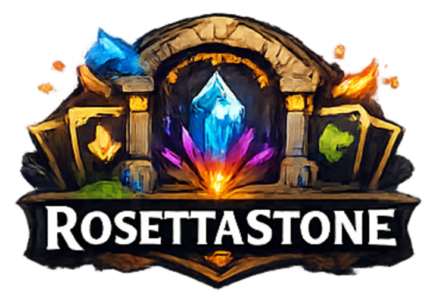

# RosettaStone

<p align="center">
  <picture>
    
  </picture>
</p>
<p align="center">
  <b>A C++17 Hearthstone simulator with C++, Python, console, and tooling interfaces</b>
</p>
<p align="center">
  <a href="LICENSE"></a>
  <a href="https://github.com/utilForever/RosettaStone/actions/workflows/windows.yml"></a>
  <a href="https://github.com/utilForever/RosettaStone/actions/workflows/ubuntu.yml"></a>
  <a href="https://github.com/utilForever/RosettaStone/actions/workflows/macos.yml"></a>
  <br />
  <a href="https://github.com/utilForever/RosettaStone/actions/workflows/ubuntu-codecov.yml"></a>
  <a href="https://codecov.io/gh/utilForever/RosettaStone"></a>
  <a href="https://github.com/utilForever/RosettaStone/actions/workflows/ubuntu-sonarcloud.yml"></a>
  <a href="https://sonarcloud.io/summary/new_code?id=RosettaStone"></a>
  <a href="https://sonarcloud.io/summary/new_code?id=RosettaStone"></a>
  <br />
  <a href="https://sonarcloud.io/summary/new_code?id=RosettaStone"></a>
  <a href="https://sonarcloud.io/summary/new_code?id=RosettaStone"></a>
  <a href="https://sonarcloud.io/summary/new_code?id=RosettaStone"></a>
  <a href="https://sonarcloud.io/summary/new_code?id=RosettaStone"></a>
  <a href="https://sonarcloud.io/summary/new_code?id=RosettaStone"></a>
  <a href="https://sonarcloud.io/summary/new_code?id=RosettaStone"></a>
</p>

RosettaStone models Hearthstone's normal play mode and Battlegrounds. The core simulator is shared by the C++ API, the `pyRosetta` Python extension, and the console and utility programs.

## What This Project Does

- Provides a reusable C++17 Hearthstone simulator library.
- Models cards, entities, zones, tasks, triggers, auras, and game flow.
- Keeps normal play and Battlegrounds in separate simulator trees.
- Exposes the simulator to Python through pybind11.
- Includes console and utility executables, card data, and C++ and Python tests.

For deeper design details, see [ARCHITECTURE.md](ARCHITECTURE.md). For coding-agent rules, see [AGENTS.md](AGENTS.md).

## Quick Start

### Prerequisites

- A C++17 compiler
- CMake 3.31.6 or later
- [vcpkg](https://vcpkg.io/) with `VCPKG_ROOT` set
- Python 3.12 or later for the Python API and tests
- Git

### 1. Clone

```bash
git clone https://github.com/utilForever/RosettaStone.git --recursive
cd RosettaStone
```

### 2. Build

```bash
cmake -S . -B build \
  -DCMAKE_BUILD_TYPE=Release \
  -DCMAKE_TOOLCHAIN_FILE="$VCPKG_ROOT/scripts/buildsystems/vcpkg.cmake"
cmake --build build --config Release
```

### 3. Run the C++ Tests

macOS, Linux, and WSL:

```bash
./build/bin/UnitTests
```

Windows release builds:

```powershell
.\build\bin\Release\UnitTests.exe
```

### 4. Install and Test the Python API

```bash
python -m pip install -r requirements.txt
python -m pip install .
python -m pytest Tests/PythonTests/
```

## Architecture at a Glance

| Area                | Paths                                                               | Purpose                                               |
| ------------------- | ------------------------------------------------------------------- | ----------------------------------------------------- |
| Core C++ API        | `Includes/Rosetta/`                                                 | Public simulator headers and models                   |
| Core implementation | `Sources/Rosetta/`                                                  | Game flow, loaders, tasks, cards, auras, and triggers |
| Battlegrounds       | `Includes/Rosetta/Battlegrounds/`, `Sources/Rosetta/Battlegrounds/` | Battlegrounds-specific simulation                     |
| Python API          | `Extensions/RosettaPython/`                                         | pybind11 bindings for `pyRosetta`                     |
| Applications        | `Extensions/RosettaConsole/`, `Extensions/RosettaTool/`             | Console and utility executables                       |
| Tests               | `Tests/UnitTests/`, `Tests/PythonTests/`                            | C++ doctest and Python pytest coverage                |
| Data                | `Resources/`, `Datas/`                                              | Card metadata and fixtures                            |
| Documentation       | `Documents/`                                                        | Build, API, card, task, and contribution guides       |

The full [architecture guide](ARCHITECTURE.md) explains game flow, the runtime model, card loading, effect timing, module boundaries, and Python API synchronization.

## Card Implementation

Implementation progress is generated from the `Implemented` column in the card lists. Run `python Scripts/card_stats.py` after updating a list.

<!-- card-stats:start -->
### [Standard Format](Documents/CardList%20-%20Standard.md)

| Set | Implemented | Total | Progress |
| --- | ---: | ---: | ---: |
| Core | 247 | 250 | 98.8% |
| Forged in the Barrens | 139 | 170 | 81.8% |
| United in Stormwind | 60 | 170 | 35.3% |
| Fractured in Alterac Valley | 61 | 170 | 35.9% |
| Voyage to the Sunken City | 22 | 170 | 12.9% |
| Murder at Castle Nathria | 17 | 170 | 10% |
| March of the Lich King | 0 | 1 | 0% |
| **Total** | **546** | **1101** | **49.6%** |

### [Wild Format](Documents/CardList%20-%20Wild.md)

| Set | Implemented | Total | Progress |
| --- | ---: | ---: | ---: |
| Legacy | 167 | 167 | 100% |
| Expert1 | 245 | 245 | 100% |
| Demon Hunter Initiate | 20 | 20 | 100% |
| Curse of Naxxramas | 30 | 30 | 100% |
| Goblins vs Gnomes | 8 | 123 | 6.5% |
| Blackrock Mountain | 31 | 31 | 100% |
| The Grand Tournament | 11 | 132 | 8.3% |
| The League of Explorers | 45 | 45 | 100% |
| Whispers of the Old Gods | 8 | 134 | 6% |
| One Night in Karazhan | 45 | 45 | 100% |
| Mean Streets of Gadgetzan | 3 | 132 | 2.3% |
| Journey to Un'Goro | 10 | 135 | 7.4% |
| Knights of the Frozen Throne | 6 | 135 | 4.4% |
| Kobolds & Catacombs | 7 | 135 | 5.2% |
| The Witchwood | 8 | 135 | 5.9% |
| The Boomsday Project | 4 | 136 | 2.9% |
| Rastakhan's Rumble | 7 | 135 | 5.2% |
| Rise of Shadows | 136 | 136 | 100% |
| Saviors of Uldum | 134 | 135 | 99.3% |
| Descent of Dragons | 140 | 140 | 100% |
| Galakrond's Awakening | 21 | 35 | 60% |
| Ashes of Outland | 82 | 135 | 60.7% |
| Scholomance Academy | 78 | 135 | 57.8% |
| Madness at the Darkmoon Faire | 79 | 170 | 46.5% |
| **Total** | **1325** | **2801** | **47.3%** |

### [Classic Format](Documents/CardList%20-%20Classic.md)

| Set | Implemented | Total | Progress |
| --- | ---: | ---: | ---: |
| Vanilla | 382 | 382 | 100% |
| **Total** | **382** | **382** | **100%** |
<!-- card-stats:end -->

See the [ability list](Documents/AbilityList.md) and [task list](Documents/TaskList.md) for mechanic and task support.

## Development

Use CMake targets as the source of truth and run the narrowest checks that cover a change. The CI workflows build on Ubuntu, macOS, and Windows, run the C++ unit tests, install `pyRosetta`, and run the Python tests.

When changing public C++ behavior, keep `Extensions/RosettaPython/` and `Tests/PythonTests/` in sync. Treat `Includes/Rosetta/RosettaStone.hpp` as generated output.

See [AGENTS.md](AGENTS.md) for the repository workflow and [Documents/Contributing.md](Documents/Contributing.md) for contribution guidelines.

## Documentation

- [Architecture](ARCHITECTURE.md)
- [Installation](Documents/Install.md)
- [How to add a card](Documents/HowToAddCard.md)
- [How to add a task](Documents/HowToAddTask.md)
- [API reference](https://utilforever.github.io/RosettaStone/)

## Related Repository

- [RosettaStone GUI](https://github.com/utilForever/RosettaStone-GUI)

## Presentations and Media

- [TFCON 2018 Poster Session](Medias/Presentations/TFCON%202018%20-%20Hearthstone%2B%2B%2C%20Hearthstone%20Simulator%20with%20Reinforcement%20Learning.pdf)
- [NDC 2019 presentation](Medias/Presentations/NDC%202019%20-%20Development%20Process%20of%20Hearthstone%20Reinforcement%20Learning%20Environment%20%28Korean%29.pdf)
- [NDC 2019 video](https://www.youtube.com/watch?v=yO9QRinXosE)

## Sponsor

[](https://www.cppdepend.com/)

## License

RosettaStone is licensed under the [GNU Affero General Public License v3.0](LICENSE).

RosettaStone is based on part of SabberStone's code.

Copyright &copy; 2017-2021 SabberStone Team, darkfriend77, and rnilva<br />
Copyright &copy; 2017-2026 [Chris Ohk](https://github.com/utilForever)

Hearthstone is an interactive game of Blizzard Entertainment, Inc. and all rights are reserved. Hearthstone is a registered trademark of Blizzard Entertainment, Inc. in the U.S. and/or other countries. This project is not affiliated with Blizzard Entertainment.
